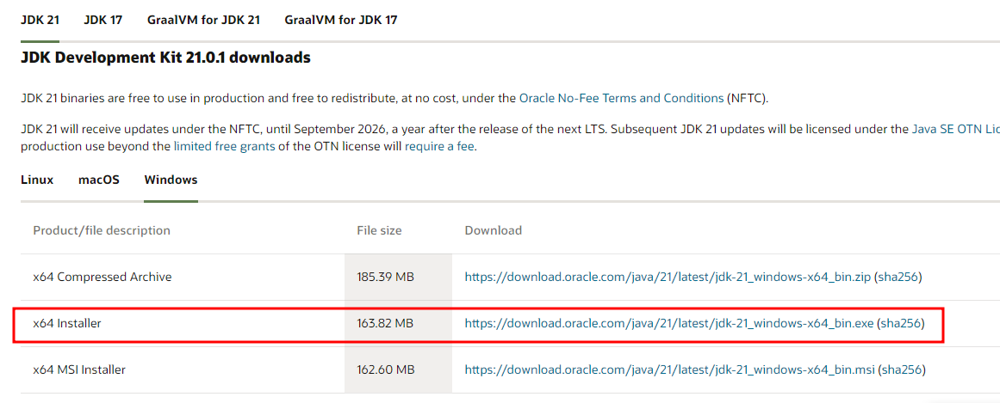
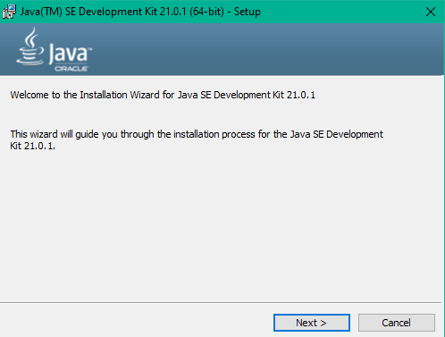
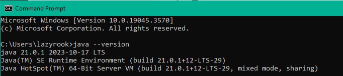
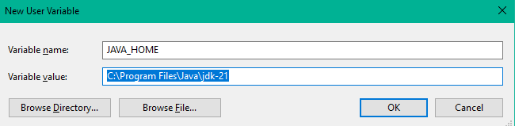
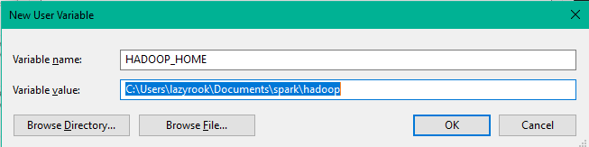
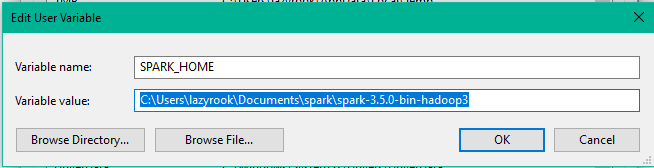
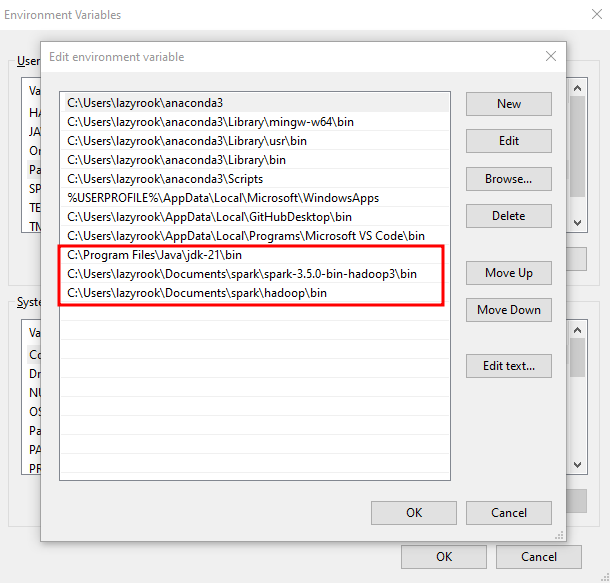

# A. Install Java JDK
1. Go to https://www.oracle.com/in/java/technologies/downloads/#jdk21-windows**
2. Download JDK 21.01 
3. Install the JDK 

4. Check if JAVA is installed and working. Launch command prompt: `java --version`**

***
# B. Clone the github repository
Clone the repo:
```
git clone https://github.com/LazyRook01/PySpark-3.5.0_Setup.git
```
***
# C. Setup Environment Variables




**Note: variable value will be determined by the path where you cloned the repository.**

**Edit Path -> New**

***
# D. Jupyter Notebook
*The jupyter notebook is there on the repo as test_spark.ipynb*
**1. Install findspark**
`!python -m pip install findspark`
2. `import findspark
findspark.init()`
3. 
```python
import pyspark
from pyspark.sql import SparkSession
spark = SparkSession.builder.getOrCreate()
df = spark.sql("select 'spark' as hello ")
df.show()
```
**Output:**

